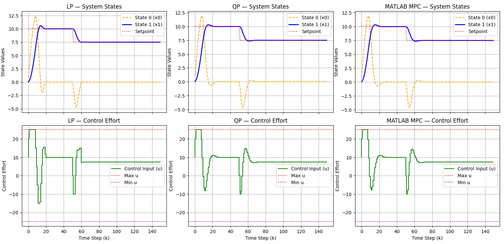

# Control Toolbox (C++)

This is my personal passion project C++ library for modern control and optimization algorithms. The goal of this repository is to learn
control theory and optimization and the implementation of these in C++. I am building the algorithms from scratch myself to learn how they work.
The rule for this project is to never use any other external libraries than the C++ standard library. The goal is that the developed algorithms are
robust and efficient enough to be used in real-world aplications.
## Key Features
- Model Predictive Control (MPC): Formulated for Linear TIme-invariant (LTI) MIMO systems. Supports Linear and Quadratic cost functions.
- Custom optimization algorithms
    - Simplex algorithm:
    - Active Set algortihm: 
- PID control: Both algorithm support antiwindup
    - Positional PID-control algorithm
    - Velocity form PID-control algorithm

## Validation and results
The C++ implementations in this library are verifies against MATLAB. Simplex- and Active Set -algortihms were tested against matlab
and gave same results. The MPC-algortihm was also tested against matlab and gave almost identical results. 

MPC-algortihm was tested on a 2 state integrator system and as seen below the results are almost identical to matlabs with the QP-cost


## Building tests

This project uses CMake. From the repo root:

```bash
mkdir build && cd build
cmake ..
cmake --build .
```

This builds `simplex_test`, `active_set_test`, and `mpc_test` into the `build/` folder. 

## Running tests
### MPC solver for Linear time invariant MIMO systems
run the code:
```
./mpc_test
```

### Active set algorithm
run the code:
```
./active_set_test
```

### Simplex algorithm
run the code:
```
./simplex_test
```


## Roadmap and future plans
I'm Currently working on implementing a system/plant class to streamline simulations and system definitions. Improvements and test for the PID class are also being worked on.

### Next features
- State feedback controller
- State predictor
- Kitagawa algorithm
- Kalman predictor
- Kalman filter